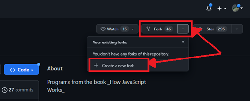

# How To Fork A Github Repository, Step by Step _[~ by Jeremy Little](mailto:jeremy@jwlittle.net?subject=Refresher-Projects%20repo,%20how-to-fork-a-repo.md%20page)_ #

*  return to root [readme](/readme.md)
*  git guides, tips and links [table of contents](/docs/git/table-of-contents.md)

1. Open your preferred browser and navigate to the desired repository.  
1. In the top right hand of the web page, near the header you will see the 'Fork' button.  
   * Click the down arrow.  
   * Then click the `Create a new fork` menu item shown below: 
       
1. This next screen presents  _3 to 4 choices_ and a _Create fork_ button:
   * Individuals who are members of 1 or more organizations and/or with multiple github accounts may select the repository owner via dropdown menu selection `(Red #1)`
   * Change the name of your copy of for **_your_** fork repo using the 'Repository Name' text box `(Green #2)`
   * Copy only the `default branch` (most common is `master` or `main`) or to copy all branches from the original repo.  Default is to only copy the single branch shown below named `master` `(Yellow #3)`
   * The label for choice #4 is unfortunately hidden behind the Owner dropdown.  Fortunately it is optional - you may change it if you wish however it can be changed at any time - so moving on...
   * When satisfied with your choices, click the `Create Fork` button. `(Orange #5)` 
         
1. Barring network hiccups in transit or issues with Github servers you should now see the newly forked repository open in the browser in your selected account :rocket:
